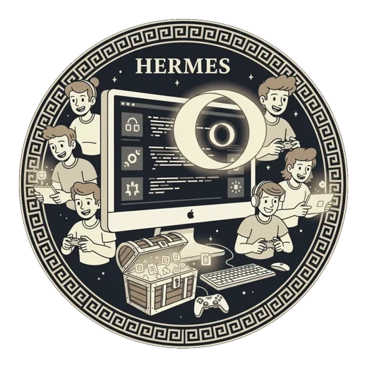

<b>English</b> · <a href="README.es.md">Español</a>

  

<h1 align="center">Hermes</h1>

<b>LAN parties never died. They were just missing an app.</b>

  Virtual LAN, chat, voice, games, screen sharing and controller sharing. 
  All in the same window.

  <a href="https://deivincci.github.io/Hermes/"><b>Website</b></a> ·
  <a href="https://github.com/Deivincci/Hermes/releases/latest"><b>Download</b></a>

---

## What is Hermes?

Getting a game going with friends left me with ten programs open at once. One to talk. One so the
games could see each other on the same network. One to share my screen. One to send files. And
another so one of us could play on someone else's PC. Each with its own account, its own window and
its own way of doing things.

Hermes is an attempt to fix that by putting it all in one place. You open Hermes, your friends join
the same room, and you're in.

| | |
|---|---|
| **A virtual LAN** | You and your friends end up on the same network even though everyone is at home. Old LAN games can see each other again, and you never touch the router. |
| **Chat and voice** | Text chat in the room and group voice, with emoji and a whiteboard to draw on. |
| **Screen sharing** | Show your screen to everyone else, with your PC's sound along with it. |
| **Video calls** | Up to four cameras, inside the private group only, and only if you turn yours on. |
| **Controller sharing** | A local two-player game, played from two different houses. See below. |
| **Send files** | Files go straight between you inside the group. They don't go up to anyone's cloud on the way. |
| **Nine games built in** | Hangman, tic-tac-toe, rock-paper-scissors, connect 4, draughts, Pictionary, Golazo, Olimpia and poker. |

### Controller sharing

A local two-player game — a couch game — knows nothing about the internet. All it knows is that two
controllers are plugged in.

With Hermes, one of you shares their screen and a controller slot along with it. A virtual
controller appears on the other person's PC, and the game is convinced a second controller just got
plugged in. You can invite up to three people: P2, P3 and P4.

---

## Download

**[Get the latest release →](https://github.com/Deivincci/Hermes/releases/latest)**

Windows 10 and 11, 64-bit. Look for **`Hermes-Setup-X.Y.Z.exe`** — that's the installer, there's
nothing else. It's free and there's no signing up: there are no accounts.

Once installed, Hermes tells you when there's a new version and installs it if you say yes. It never
downloads or installs anything on its own.

---

## Before you install

Four things better read now than discovered later.

### 1. Windows will warn you that it doesn't recognise the app

When you open the installer you'll get the blue SmartScreen page: *"Windows protected your PC"* and
*"unrecognised app"*.

**Why:** signing an application costs a few hundred euros a year, and Hermes isn't signed yet. That
warning isn't saying the program is bad; it's saying Windows doesn't recognise who signed it. Nobody
did.

**How to carry on:** click **More info** and then **Run anyway**.

If you'd rather check for yourself, every release publishes a `.sha256` file next to the installer
with its fingerprint, so you can confirm that what you downloaded is what was published.

### 2. It installs two drivers, and they can be removed

Hermes needs two pieces that sit below the operating system, and the installer puts them there:

- **TAP-Windows** — the virtual network adapter. This is what puts your PC and your friends' on the
  same network so that LAN games can see each other.
- **ViGEmBus** — the virtual controller. This is what makes a game believe another controller has
  been plugged in when someone shares theirs.

Without them there's no virtual LAN and no controller sharing: that's half of what Hermes does. When
you uninstall, the uninstaller asks whether to remove them too, with two boxes already ticked.

### 3. The room is public. The group is the private one

**The room** is the public place. Anyone who knows the name can walk in, so there may well be
strangers in it. It's for meeting people, chatting and playing.

**The group** is the private space, and you get in by invitation. Voice, files and camera exist
**only** inside the group.

This isn't a setting you can flip by accident: in a room those features simply aren't there.

### 4. It's a beta, with everything that means

Hermes is made by one person and it's in beta. There will be bugs, half-finished corners and
releases that fix what the last one broke. If you're after something finished with a company behind
it, this isn't it yet.

What you can expect: that problems get told rather than buried, and that every release says what
changed. Hermes keeps a log in `hermes.log` inside its own folder, which is what you need to work
out what happened.

There are no accounts and no passwords: you don't register anywhere and you don't hand over an email
to use it.

---

  This repository publishes the downloads and the website. The source isn't public for now.

